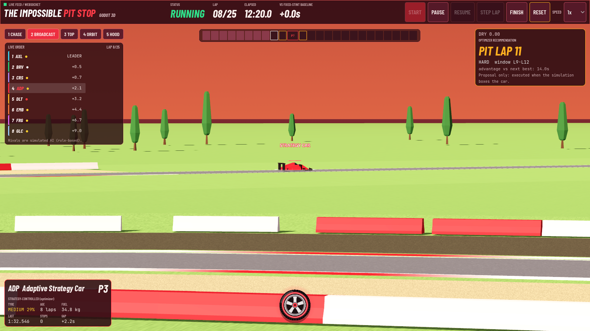

# ClutchAI: Race Strategist

A deterministic endurance-race simulator with a **rolling-horizon pit-strategy optimizer**, a fixed-stint
baseline, a paired benchmark, and a live **interactive 3D Silverstone** with eight cars.
Everything runs locally: no paid services, API keys, or cloud models.

> The race model is synthetic and illustrative. Its parameters are not calibrated to real motorsport data, and
> the rival cars are simulated AI, not real drivers or real data.

## Run the Godot game on a new laptop (Windows, step by step)

The Godot game is a native 3D client. The race and the AI strategy engine run in a small Python backend on your own
machine, and the game connects to it. You need **no Node.js** and no account for this path.

**1. Install two free tools** (once). If a command below says "not recognised" afterwards, close and reopen PowerShell.

| Tool | Why | Install |
|---|---|---|
| **Git** | downloads the project | https://git-scm.com/download/win |
| **uv** | installs Python 3.12 and the backend packages for you | `winget install --id=astral-sh.uv -e` (or https://docs.astral.sh/uv/getting-started/installation/) |

**2. Download the project and set it up** (once; open PowerShell where you want the folder):

```powershell
git clone https://github.com/SUKESH0321/ClutchAI.git
cd ClutchAI
git checkout web-renderer-upgrade     # only until this branch is merged into main
powershell -ExecutionPolicy Bypass -File run.ps1 setup -NoWeb
powershell -ExecutionPolicy Bypass -File run.ps1 get-godot
```

`setup -NoWeb` creates the Python environment and installs the backend packages. `get-godot` downloads the free Godot 4.6.3
engine (one 80 MB `.exe`, no installer) into `tools\godot`. If you already have Godot 4.6, skip `get-godot`
(see "If Godot is somewhere else" below).

**3. Play** (every time):

```powershell
powershell -ExecutionPolicy Bypass -File run.ps1 play
```

This starts the backend in a second window and opens the game. The very first launch spends about 20 seconds importing the
game's models (it prints "First run: importing game assets"); later launches start immediately.

**4. In the game**

| What | How |
|---|---|
| Start / pause the race | **Start** button in the top bar, or **Space** |
| Change circuit | **TRACK** dropdown at the top left, or press **T** (Silverstone, Spa-Francorchamps, Monza, Zandvoort). The race resets on the new circuit |
| Cameras | **1** chase, **2** broadcast, **3** top-down, **4** orbit, **5** hood; mouse wheel zooms, drag rotates in orbit |
| Race console (telemetry, strategy, events) | **C** or the tyre button at the bottom |
| Rain / safety car | console, **Events** tab |
| Switch car to follow | **Tab** |
| Graphics quality | **Q** cycles performance / balanced / high / ultra. The game picks a sensible one for your GPU and lowers it by itself if the frame rate drops |
| Reset race / next lap | **R** / **N** |

**If the window shows "BACKEND OFFLINE":** the backend is not running. Run `run.ps1 backend` in one PowerShell window and leave it open,
then `run.ps1 godot` in another. The game reconnects by itself.

**If Godot is somewhere else:** `run.ps1 play -Godot "C:\path\to\Godot_v4.6.x_win64.exe"`, or open the `godot` folder in the Godot 4.6 editor
(Import, then **F5**) while the backend is running. Use the standard Godot build, not the .NET one.

**Requirements:** Windows 10/11, any GPU that supports OpenGL 3.3 (the game uses Godot's Compatibility renderer, so integrated graphics work),
about 1 GB of free disk space, and internet only for the downloads in steps 1 and 2.

**macOS / Linux:** download Godot 4.6 for your system from https://godotengine.org/download, then run the backend by hand
(`uv venv --python 3.12 backend/.venv`, `uv pip install --python backend/.venv/bin/python -r backend/requirements.txt`,
then `cd backend && .venv/bin/python -m uvicorn app.main:app --port 8000`) and start the game with
`godot --path godot` (run `godot --headless --path godot --import` once first). Only Windows has been tested.

## Quick start: download and run (Windows)

You need three free tools. Everything else is installed for you.

| Tool | Why | Get it |
|---|---|---|
| **Git** | download the project | https://git-scm.com/download/win |
| **Node.js 18+** | the browser app | https://nodejs.org |
| **uv** | installs Python 3.12 and the backend packages | https://docs.astral.sh/uv/getting-started/installation/ |
| **Godot 4.6** (optional) | the native 3D game | https://godotengine.org/download |

**1. Download and set up** (once):

```powershell
git clone https://github.com/SUKESH0321/ClutchAI.git
cd ClutchAI
powershell -ExecutionPolicy Bypass -File run.ps1 setup
```

**2. Start the AI / race engine** (leave this terminal open):

```powershell
powershell -ExecutionPolicy Bypass -File run.ps1 backend
```

This is the Python backend: it simulates the race and runs the strategy optimizer. Nothing works without it.

**3. Open a second terminal in the same folder and pick a front end:**

```powershell
powershell -ExecutionPolicy Bypass -File run.ps1 web      # browser app: open http://localhost:5173
powershell -ExecutionPolicy Bypass -File run.ps1 godot    # Godot 3D game (needs the backend running; or use `run.ps1 play`)
```

**4. Play:** press **Start**. Click the tyre button at the bottom (or press `C`) for the race console. In
**Events & controls** you can trigger rain or a safety car and watch the optimizer replan and box the car.

**Godot notes.** The full Godot walkthrough (including a new laptop) is in "Run the Godot game on a new laptop" above.
`run.ps1 godot` looks in `tools\godot` (from `run.ps1 get-godot`), your Downloads, Desktop and `Develop` folders; otherwise pass
`-Godot "C:\path\to\Godot_v4.6.x_win64.exe"`.

**Run the AI benchmark yourself** (100 paired races, about 30 seconds):

```powershell
cd backend
.\.venv\Scripts\python.exe -m app.evaluation --trials 100 --seed-start 10000 --out ..\results
```

**Check everything works:** `powershell -ExecutionPolicy Bypass -File run.ps1 test` (backend, web and Godot tests).

**Troubleshooting**
* *Blank page or "Connecting to the strategy backend"*: the backend (step 2) is not running.
* *`run.ps1 cannot be loaded`*: use the `-ExecutionPolicy Bypass` form shown above.
* *Port 8000 or 5173 already in use*: close the old terminal, or the previous run, and start again.
* macOS / Linux: the code is cross-platform but only Windows was tested. Run the commands in `run.ps1` by hand
  (`uv venv --python 3.12 backend/.venv`, `uv pip install -r backend/requirements.txt`, `npm install` in `frontend/`,
  then `python -m uvicorn app.main:app --port 8000` in `backend/` and `npm run dev` in `frontend/`).

## What it does

* Lap-by-lap physics: fuel burn and fuel-mass lap-time effect, tyre wear (Soft / Medium / Hard / Wet), weather
  (rain, wetness dynamics), safety car (slow pace, cheaper pit stop), traffic and degradation noise, pit-stop cost.
* **Adaptive optimizer**: samples possible futures (rain, safety car, degradation) from a prior and enumerates
  every feasible 0/1/2-stop plan, then replans when conditions materially change.
* **Fixed-stint baseline** following the same physics and rules, compared on matched seeds.
* **Live 3D race** (Three.js / React Three Fiber) on the real Silverstone layout with a start/finish gantry,
  kerbs, pit lane, sector markers, grandstands, barriers, rain and a safety car.
* Race controls: start, pause, resume, step lap, finish, reset, speed (0.5x to 16x), inject rain, clear rain,
  deploy or withdraw the safety car, force a strategy refresh.
* Telemetry, strategy panel with an explanation, charts (actual vs projected), strategy timeline, event log, and
  a benchmark panel that runs real paired trials.

## Architecture

```
backend/app
  config.py       race configuration (Pydantic) + configs/*.json loader
  physics.py      ALL formulas (single source of truth; used by the engine AND the optimizer)
  events.py       hidden world: weather / safety car / noise generated up front from the seed; manual events
  simulation.py   RaceEngine: pure lap-by-lap engine; policies only see a public RaceSnapshot
  scenarios.py    optimizer's sampled futures (never imports the hidden schedule; a test enforces it)
  optimizer.py    stint-cost tables + exhaustive plan enumeration + explanation + projection
  strategy.py     AdaptivePolicy (optimizer), FixedStintBaseline, CompetitorPolicy (rule-based rivals)
  session.py      live session: strategy car + shadow baseline + 7 rivals, WebSocket broadcast, benchmark runner
  evaluation.py   paired benchmark + CLI + JSON/CSV export
  main.py         FastAPI (REST + /ws/race)
frontend/src
  lib/circuit.ts      circuit geometry + helpers (pointAt, pitAt, distanceToTrack)
  lib/raceClock.ts    authoritative lap timing -> position on track (pure, unit-tested)
  components/scene/   3D scene (track geometry, environment, cars, camera rig, rain)
  components/RaceView.tsx  3D view + HUD (timing tower, selected-car card, pit window, lap strip)
scripts/build_circuit.py   dataset CSV -> circuit JSON
data/                      raw circuit CSV + license + provenance notes
```

Separation of concerns: **physics** (physics.py) and the **authoritative simulation** (simulation.py) never depend on
rendering. The browser only turns recorded lap times into positions.

### How the 3D race stays faithful to the simulation

* The backend steps one lap for every car, then pushes one state (REST/WebSocket). Each car carries its full lap
  history with cumulative `elapsed_s`.
* The frontend `RaceClock` eases a visual race time toward the moment the leader has completed the newest lap, so
  rendering is smooth but never runs ahead of known data and never alters reported lap times.
* A car's position at time t is a pure function of its lap times: lap k covers the circuit in exactly its simulated
  `lap_time_s`, so safety-car laps visibly run slower, and gaps and order come from the same numbers shown in telemetry.
* **Pit stops**: on a lap with `pitted=true` the car runs the main track to the pit entry, drives the pit lane to its
  box, stands still for the service share of the simulated pit loss (service / (service + transit)), and the lap ends
  at the line; the next lap leaves via the pit exit and merges to the track. The pit loss is added to that lap's
  time once, by the engine.
* A recommendation is a **proposal** (red pulsing pit lane, "P?" in the lap strip). It becomes an executed stop only
  when the simulation actually boxes the car (green pit lane, "P" in the lap strip).

### Rival cars (simulated, not real data)

Seven rivals are full `RaceEngine` instances with the same physics and the same hidden weather and safety-car
schedule as the strategy car, but their own noise, a deterministic pace offset (-0.45 s to +0.65 s per lap), a
different starting compound and a simple rule-based policy (one scheduled stop; they switch to wets at their own
wetness threshold, pit under a safety car if a stop is near, and return to slicks when the track dries). They are
**not** optimizer-controlled. **Traffic interaction is not modelled**: rivals do not slow the strategy car (the
existing random traffic penalty remains), so there is no overtaking or blocking physics.

## Physics (all in `backend/app/physics.py`)

```
T_lap = T_base + T_fuel + T_compound + T_wear + T_weather + T_traffic + T_noise + T_fuelsave + T_driver + T_event
T_fuel     = 0.035 s/kg * fuel_at_start_of_lap
T_wear     = a_c*w + b_c*w^2                       w = wear at the start of the lap, in [0,1]
w_next     = min(1, w + r_c * degradation * conditions)     r: Soft 0.07, Medium 0.04, Hard 0.025 per lap
T_weather  = 5*wet + (12*wet on slicks | 5*(1-wet) on Wet tyres)
T_event    = max(0, 1.4*T_base - racing_time) under a safety car (no double counting)
pit loss   = (20 s service + 5 s transit) * (0.45 under a safety car)
```
Fuel never goes negative (a fuel-save mode with a pace penalty kicks in if the tank cannot cover the race).
A tyre set is kept within `max_wear = 0.8`; the engine adds an equal wear-limit safety net for every policy.
A two-different-dry-compounds rule is enforced (waived once Wet tyres are used).

## Optimizer

Because there is no in-race refuelling, per-lap fuel, wetness and safety-car state depend only on the sampled
scenario, not on the plan. So the cost of a fresh stint (compound, first lap, last lap) is a function of the
scenario alone. The optimizer precomputes those stint costs with `physics.lap_time` (the same function the engine
uses), then prices each candidate plan by summing table entries plus `pit_loss` on the stop lap in each scenario.

* Candidates: all feasible plans with 0, 1 or 2 further stops (every lap and compound), respecting tyre
  availability, minimum stint length, the two-compound rule and the wear limit.
* **Not searched**: plans with 3+ stops (documented limitation; beam search was not implemented).
* Feasibility: a stint that exceeds the wear limit in more than 10% of sampled futures is rejected; in the remaining
  futures an assumed unplanned-stop cost is charged. Plans with unavailable compounds, too-short stints, a broken
  two-compound rule or negative fuel are never generated. Measured result: 0 tyre-limit violations and 0 invalid
  plans for the adaptive car over the 100 held-out races.
* Objective: expected remaining time over M sampled futures (16 live, 10 in the benchmark). An optional CVaR
  term exists (`cvar_lambda`, default 0, not used for the reported results).
* Rolling horizon: replans only on triggers (race start, rain/wetness change, safety-car start/end, degradation
  deviation, pit completed, plan infeasible, pit window). A hysteresis (0.3 s) keeps the current plan unless clearly beaten.
* Information barrier: policies receive a `RaceSnapshot` only; scenarios are built from the public state and the
  configured event prior. `scenarios.py` does not import the hidden schedule, and a test runs the optimizer on two
  worlds that differ only in their hidden future and asserts identical output.
* Output: action, pit lap, compound, plan, projected finish, current-plan finish, best alternative, time advantage,
  action options, top candidates (with p10/p90 across futures), counts, trigger, explanation, warnings.
  `scenario_win_share` is the fraction of sampled futures in which the chosen plan is at least as good as the best alternative.

## Baseline and benchmark methodology

The baseline pits on a fixed lap (default lap 12, scaled with race length), to Hard tyres, or to Wet tyres if the track is wet
at that moment; it never reacts otherwise. Same physics, rules and safety net as the adaptive policy.

Each trial builds one hidden world from its seed and runs both policies on **identical copies**. Seeds 1-999 were used
for development and tuning; **seeds 10000+ are the held-out evaluation set** used for reported numbers.

Held-out result (100 paired trials, seeds 10000-10099, 10 futures per decision, `results/latest.json` and `.csv`):

| Metric | Value |
|---|---|
| Baseline mean race time | 2433.11 s |
| Adaptive mean race time | 2425.69 s |
| Mean time saved | **7.43 s** (median 0.32 s, std 18.98 s, 95% CI 3.71 to 11.15 s) |
| Improvement | 0.305% |
| Win / loss / tie | 59 / 31 / 10 (win rate 59.0%) |
| Invalid plans (adaptive / baseline) | 0 / 0 |
| Tyre-limit violations (adaptive / baseline) | 0 / 1 |
| Decision time | mean 39 ms, p95 63 ms |

| Race type | n | Mean saved | Win rate | Loss rate |
|---|---|---|---|---|
| Dry | 22 | -0.21 s | 45% | 36% |
| Safety car only | 21 | +2.63 s | 48% | 33% |
| Rain only | 31 | +11.92 s | 65% | 32% |
| Rain and safety car | 26 | +12.41 s | 73% | 23% |

Honest reading: the gains come from rain and safety-car races. In dry races the baseline is near-optimal and the
adaptive strategy is statistically tied (slightly behind on average). The adaptive strategy also loses about a
third of races, mostly to bad luck (for example a safety car arriving just after it already pitted). The model prior
used by the sampler matches the generator of the simulated worlds, so results under a mismatched prior are not measured.
Re-run them with the commands below.

## Install and run (Windows PowerShell; needs Python 3.12 via uv, and Node 18+)

```powershell
uv venv --python 3.12 backend\.venv
uv pip install --python backend\.venv\Scripts\python.exe -r backend\requirements.txt
cd frontend
npm install
```

Backend (terminal 1, from `backend/`):

```powershell
.\.venv\Scripts\python.exe -m uvicorn app.main:app --port 8000
```

Frontend (terminal 2, from `frontend/`):

```powershell
npm run dev
```
Open http://localhost:5173. Add `?quality=low` to the URL on weak GPUs (disables shadows, lower resolution). The
resolution also adapts automatically when the frame rate drops.

Tests and checks:

```powershell
cd backend;  .\.venv\Scripts\python.exe -m pytest -q          # 43 tests
cd frontend; npm test                                          # 7 tests (circuit + car placement)
cd frontend; npm run build                                     # type-check + production build
cd backend;  .\.venv\Scripts\python.exe -m app.evaluation --trials 100 --seed-start 10000 --out ..\results
cd backend;  .\.venv\Scripts\python.exe -m app.demo            # headless demo sequence
```

## Demo script

1. Reset on `demo` (seed 42, no random events). Start at 2x. Note the optimizer's first plan (Medium to Hard around lap 11).
2. At lap 8 open the race console (wheel button), go to **Events & controls** and press **Heavy rain**. Watch the WEATHER_CHANGE replan, the red "Proposed stop: WET" pit lane, and the car boxing.
   The baseline ghost car (white outline) stays on slicks until its fixed stop.
3. Around lap 13 press **Deploy safety car** (same tab). The field slows to safety-car pace, and the pit cost shown in the explanation drops.
4. Finish the race (or press **Finish**); compare the strategy timeline of the adaptive car and the baseline.
5. Run the benchmark panel (100 trials takes about 25 s) or load the saved results.
Backup: reset on `demo_scripted` (rain at lap 8 and a safety car at lap 14 are pre-scheduled) and just press Start.

## Godot 3D client (optional)

`godot/` is a native Godot 4.6 client for the same live race: CC0 Kenney car, tree, grandstand and pit
models on the real Silverstone geometry, five camera modes (chase, trackside broadcast, top-down, orbit, hood),
a rain shader, and the same maroon HUD with a race console. It talks to the existing backend over the same
WebSocket and REST API, so the optimizer, physics and benchmark are unchanged. See [godot/README.md](godot/README.md)
for how to run it, the controls, credits and `godot/check.ps1`.



## Godot vegetation (supplied tree and grass models)
The Godot client grows 7 supplied realistic trees (3 large, 3 medium, 1 bush; textured, alpha-cut leaves) and 4 grass clumps around every circuit, in forest
stands with a 46 m clearance from the track edge, away from the pit lane, grandstands and the outside of corners. They are optimised from the 55 MB originals in
`assets/` to about 5 MB by `scripts/godot_assets/build_vegetation.mjs` (run `npm install @gltf-transform/core @gltf-transform/extensions meshoptimizer sharp` next to it first), and drawn as
chunked MultiMeshes with a visibility range. Press **Q** to change quality: grass is off in `performance`, half in `balanced`, full in `high`/`ultra`; trees cast shadows only in `high`/`ultra`
(about 190 fps in chase on the RTX 3050 vs 340 in `balanced`). The licence of these two models is unknown (see ASSET_CREDITS.md).

## Interface layout

A deep maroon-red racing identity. The 3D circuit fills the whole window under a compact single-row race header
(status, lap, elapsed time, gap to the fixed-stint baseline, start / pause / resume / step / finish / reset, speed).
Everything else lives in a floating **race console** that rises from the bottom when you click the **racing-wheel
button** (bottom centre; click again, press the X, or press Esc to close). The console is closed by default, never
resizes the 3D canvas (the view just slides up while it is open), and has five tabs:

| Tab | Contents |
|---|---|
| Telemetry | tyres (compound, wear, age, sets left), fuel with reserve marker, last/best lap, track and rain, safety-car and race status lights, last-lap time breakdown |
| Strategy engine | BOX THIS LAP / PIT LAP n / STAY OUT, projected and current-plan finish, best alternative, advantage, plans and futures counted, latency, trigger, explanation, warnings, top candidates (flashes when the recommendation changes) |
| Timeline | adaptive vs baseline stints; completed, planned and next-recommended stops are drawn differently |
| Analytics | wear and lap-time charts (solid = measured, dashed = projected) and the paired benchmark panel |
| Events & controls | race controls, config selector, speed buttons, rain / safety-car injection, live event log |

Arrow keys move between tabs. The wheel button shows a pulsing BOX badge while the optimizer wants a stop and the console is closed.

## Camera controls

3D view (orbit, pan, zoom), Top-down (pan and zoom), Follow car (chase camera on the selected car), Reset camera.
Click a car or a row in the timing tower to select it and inspect its telemetry.

## API

`GET /api/health` · `GET /api/configs` · `POST /api/race/{reset,start,pause,resume,step,finish,speed,event}` ·
`GET /api/race/state` · `GET /api/strategy/recommendation?refresh=` · `POST /api/evaluation/run` ·
`GET /api/evaluation/{status,results,results.csv}` · `WS /ws/race`. The REST polling fallback activates automatically
if the WebSocket drops.

## Visual upgrade: assets, cameras, quality
The web view uses locally stored CC0 assets (see [ASSET_CREDITS.md](ASSET_CREDITS.md)): Kenney race-car GLBs recoloured per
fictional team (wheel spin from real distance, steering from track curvature, pitch/roll, brake lights, number decals),
Poly Haven PBR asphalt/grass/gravel/concrete/rubber, HDRI skies (dry and overcast), terrain hills, kerbs, barriers, tyre
walls, grandstands, pit garages, lamp posts, fences, marshal posts, trees and fictional ad boards.
Weather is driven by the simulation's wetness: HDRI cross-fade, fog, darker/shinier asphalt with puddles, rain streaks and
car spray. Visuals never change lap times, fuel, wear or benchmarks.

* Cars: the supplied F1 model (optimised by `scripts/f1car`, hi/lo detail switched by camera distance) in fictional team colours with
  centre stripe, number decals, wheel spin from real distance, steering from track curvature, pitch/roll, brake lights and compound-coloured wheel
  rings. The Kenney cars are the safety car and the automatic fallback if the F1 model fails to load.
* Motion: cars brake for corners and accelerate out (a curvature-based speed profile redistributes distance *within* each lap; lap boundaries, lap
  times, gaps, fuel and wear are untouched), launch from the grid, decelerate into and accelerate out of the pit box. Playback is 12 s per lap at 1x
  (speeds 0.25x to 16x).
* Race moments tied to real state: five start lights with the clock held on the grid, a waving chequered flag + confetti when the leader finishes,
  pit crew (two pooled crews of six) that walks out when a car enters the lane, works only while it is stationary in its box and cheers on release,
  crowd on the grandstand seats that cheers at lights-out, safety car and the flag, rubber marks in the real braking zones that build with laps and
  wash away in the wet.
* Level of detail: cars (hi/lo model by distance), props and crowd culled by camera distance/height, per-preset counts of trees, crowd, tyre walls, rain and spray.
* Cameras: 3D view, Top-down, Follow car, Low chase, Corner (trackside, picks the next corner), Overview (reset). Follow/chase pull back and to the
  side while the followed car is being serviced.
* Quality selector (top right of the view): performance / balanced (default) / high / ultra change DPR, shadow resolution,
  tree/tyre-wall/spray/rain counts, reflections and fog. `?quality=low` forces performance. `?cam=chase` opens in a camera mode.
* If a model or texture fails to load the affected element is skipped or replaced with a simple primitive; the race still runs.

## Circuits, vegetation and the wheel button
* **Four circuits** (Silverstone, Spa-Francorchamps, Monza, Zandvoort): click **TRACK** in the header. Each has its own measured geometry from the TUM
  racetrack-database (LGPL-3.0, OSM-derived), a preview drawn from that geometry, and its own simulation inputs. Switching during a race asks for
  confirmation and resets the race (new engines, lap history, strategy, baseline, rivals); the 3D venue, camera, cars, pit lane and the Godot client follow.
  The backend owns the selection (`state.circuit_id`, `POST /api/race/reset {"circuit": "spa"}`, `GET /api/circuits`).
* **What is circuit-dependent** (`backend/app/tracks.py`, derived from geometry, nothing typed in per circuit): base lap time (curvature-limited speed profile,
  calibrated so Silverstone keeps its 90 s), fuel burn and starting load (lap length), tyre wear (length x lateral load), pit-lane time loss (lane length vs mean
  speed). The fuel/tyre/weather/safety-car *models* are unchanged. Lap times are relative model estimates, not real lap times.
* **Not available / approximate:** elevation (every circuit is flat), surveyed pit lanes (a synthetic lane at the start straight on every circuit), official sector
  splits (equal thirds), official turn numbering (corners are detected from curvature; published turn counts are shown for reference), start line (first dataset point).
  Landmark names (La Source, Eau Rouge, Parabolica...) are inferred from the order of detected corners.
* **Benchmarks are per circuit** (`results/latest_<circuit>.json`; `python -m app.evaluation --circuit spa`); the Analytics tab shows the selected circuit's own results only.
* **Vegetation:** up to 42,000 instanced trees and 24,000 bushes (13 tree and 5 bush models from the CC0 Kenney Nature Kit) in forest clusters, with clearance from
  the track edge/runoff/barriers, the pit lane, grandstands and open sight-line zones on the outside of corners. Draw calls are bounded by chunking (450 m) with
  frustum culling and a distance LOD (detailed models near the camera, 20-60 triangle stand-ins beyond). The **Vegetation** selector (low / medium / high / ultra / auto)
  is separate from **Graphics**.
* **Wheel button:** a real 3D Formula-style wheel (slick tyre with red compound band, vented metal wheel face, red lock nut) in its own small WebGL canvas that ignores the pointer;
  it floats, spins, scales on hover, and still opens/closes the console.

## Known limitations and unverified items

* Circuit data: centerline and widths are real (TUM FTM database, OpenStreetMap-derived), but the start/finish
  position, pit lane, sector splits and corner numbering are approximations (see `data/README.md`). No elevation.
* Rival cars are rule-based AI with no on-track interaction (no overtaking or blocking physics).
* The optimizer searches at most two further stops; the safety-car pit discount is a multiplicative simplification.
* Visual limits: the crowd and pit crew are blocky low-poly figures; crew members do not carry wheels (they animate in place and the new
  compound appears on the car when the backend's stop completes); the speed profile is a visual model (it is not the physics in `physics.py`);
  rubber marks are decals in the braking zones, not simulated tyre contact. The F1 model's licence is unverified (see ASSET_CREDITS.md).
  Screenshots were taken in headless Chrome with software GL (SwiftShader) so frame rate is unmeasured.
* The 3D scene uses enlarged cars. **Frame rate was not measured**: the preview browser used for
  development throttles animation when its pane is hidden, so only functional behaviour was verified there.
  Tested on one Intel UHD integrated GPU in that preview only; not tested on other browsers or touch devices.
* Parameters are synthetic. Benchmarks assume the sampler prior matches the world generator.
* Beam search and the full risk-aware objective were not implemented (CVaR is available but unused).

## Team split

Strategy and optimization: `scenarios.py`, `optimizer.py`, `AdaptivePolicy`. Physics, simulation and events: `config.py`,
`physics.py`, `events.py`, `simulation.py`. 3D dashboard: `frontend/src`. Integration, benchmark, tests, demo: `session.py`,
`main.py`, `evaluation.py`, `tests/`. They integrate through the shared contracts in `backend/app/schemas.py` and
`frontend/src/types/race.ts`.
