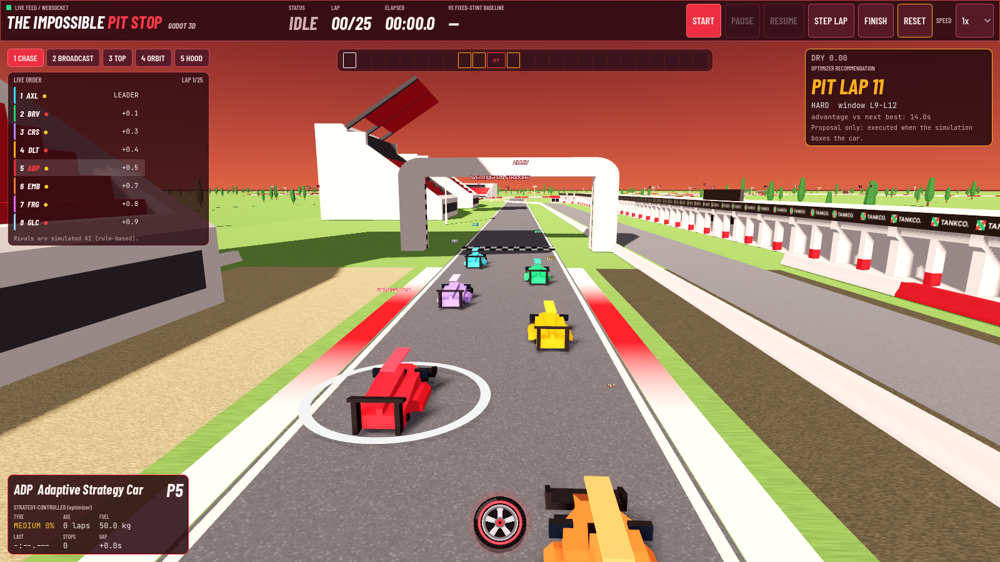

# Godot 3D client

A native Godot 4.6 front end for the race-strategy simulator. It renders the **same live race** the web
app shows (same Python backend, same optimizer, same real Silverstone geometry) with 3D models, cameras,
rain and a maroon-red HUD. It contains no race logic: every number comes from the backend state.



## Run it

1. Start the backend (from `backend/`):
   `.\.venv\Scripts\python.exe -m uvicorn app.main:app --port 8000`
2. Open Godot 4.6, **Import** `godot/project.godot`, press **F5** (or run
   `Godot_v4.6.3-stable_win64.exe --path godot`).
   If the backend is not running the window shows a "Connecting to the strategy backend" notice; start it
   and the client reconnects by itself. To use another machine: `-- --host=192.168.1.20:8000`.

Uses the **Compatibility (OpenGL)** renderer so it runs on integrated GPUs too.

## Controls

| Input | Action |
|---|---|
| `1` Chase, `2` Broadcast, `3` Top-down, `4` Orbit, `5` Hood | camera modes (also buttons, top-left) |
| mouse drag / wheel | orbit and zoom (Orbit mode); zoom (Top-down) |
| `Tab` or click a row in the timing tower | select a car (the follow cameras track it) |
| `Space` start / pause / resume, `N` step one lap, `R` reset | race control (also header buttons) |
| `C` or the tyre button (bottom centre) | open / close the race console |
| `Esc` | close the console |

The race console has five tabs: **Telemetry**, **Strategy engine**, **Timeline**, **Analytics** (wear and
lap-time charts plus the saved benchmark) and **Events & controls** (race controls, rain, safety car, event log).

## How it stays faithful to the simulation

* The backend pushes one state per simulated lap (WebSocket `/ws/race`); commands use the REST API.
* `scripts/race_clock.gd` (a port of `frontend/src/lib/raceClock.ts`) turns each car's recorded lap times
  into a position on the circuit. Lap k covers the circuit in exactly its simulated lap time, so
  safety-car laps visibly run slower and the gaps in the timing tower are the real numbers.
* Pit stops follow the pit lane (entry, box, exit); the car stands still for the service share of the
  simulated pit loss. A recommendation is only a *proposal* (pulsing red lap-strip marker); a green marker
  appears when the simulation actually executes the stop.
* Rival cars are simulated, rule-based AI, labelled as such. Rain and wet-track visuals use the on-screen
  lap's real wetness.

## Layout

```
scripts/backend.gd      autoload: WebSocket + REST client
scripts/circuit.gd      circuit data + mesh strips (road, kerbs, gravel, pit lane)
scripts/race_clock.gd   authoritative lap data -> track position
scripts/world.gd        environment, track, scenery (Kenney models), labels
scripts/car_view.gd     one race car (model, team paint, label)
scripts/main.gd         orchestration, cameras, effects
scripts/hud.gd          header, timing tower, console, toasts
scripts/{style,plot,timeline_view,wheel_button}.gd   theme and custom-drawn widgets
assets/kenney/          CC0 models      assets/fonts/   OFL fonts      assets/rain.gdshader
tools/                  headless tests and inspection helpers
check.ps1               runs every check below
```

## Checks

```powershell
powershell -ExecutionPolicy Bypass -File godot\check.ps1
```
It fails on any GDScript parse or runtime error (this is what protects against a blank window), runs the
placement tests (`tools/test_placement.gd`: no teleporting, laps end at the line, pit stop timing), and,
if the backend is up, the integration test (`tools/test_backend.gd`) and a headless boot of the main scene.
`tools/car_stage.gd` renders the four car models for a visual check.

Debug options after `--`: `--cam=chase|broadcast|top|orbit|hood`, `--console --tab=N`, `--wet=0.8`,
`--noghost`, `--shot=<png> --shot-frames=N`, `--burst=<prefix> --burst-every=N --shot-frames=COUNT`.

## Credits and licences

* Models: **Racing Kit by Kenney** (https://kenney.nl/assets/racing-kit), **CC0**; licence file in `assets/kenney/`.
  Palette remapped in code; car bodies are painted in team colours at runtime.
* Fonts: Barlow Condensed and JetBrains Mono, SIL Open Font License (files in `assets/fonts/`).
* Circuit: TUM FTM racetrack-database (LGPL-3.0, OpenStreetMap data); see `../data/README.md` for what is real
  and what is approximate (start line, pit lane, sectors, corner numbers).

## Known limitations

* The Godot client has no multi-tab benchmark runner; run benchmarks from the web app or the CLI (the Analytics
  tab shows the saved results).
* Cars are enlarged versions of simple low-poly models; the world is flat (no elevation data); scenery is
  procedural. Sound is not implemented.
* Verified here: scripts parse, placement and backend integration tests pass, and the scene renders on an
  NVIDIA RTX 3050 laptop GPU. Frame rate was not measured, and it was not tested on other GPUs or on macOS/Linux.


## Cars, quality and frame rate
* Racers use the supplied F1 model (`assets/f1`, built by `scripts/f1car`): a ~67k-triangle near model with spinning, steering wheels and brake
  lights, and a ~5k-triangle far model (3 draw calls) swapped by camera distance. The paint shader recolours it per team (centre stripe in a
  second colour). The safety car is still a Kenney car. The Kenney cars are also the fallback if the F1 files are missing.
* **Q** cycles quality presets (performance / balanced / high / ultra: shadow splits and distance, shadow atlas, MSAA, glow, fog, tree count,
  prop shadows, car LOD distance). The default is `balanced` on a discrete GPU and `performance` on an integrated one; if the frame rate stays well under
  the display refresh the client steps down one preset by itself. Force one with `-- --quality=high`. A small label bottom right shows fps and preset.
* Other savings: sun shadows are switched off while the camera is high above the circuit (orbit/top), the full-screen rain shader only draws in
  the wet, per-frame work (baseline laps, label scaling, wetness/fog/sun updates) is cached or done only on change.
* Measure it: `scripts/godot_probe.ps1` (renderer CPU+GPU ms, old commit vs working tree), `scripts/godot_compare.ps1`, `scripts/godot_bench.ps1`,
  or `-- --bench=10 --novsync --quality=balanced`. Note: the Compatibility renderer ignores 3D render-scale, so presets (not resolution) are the lever.
